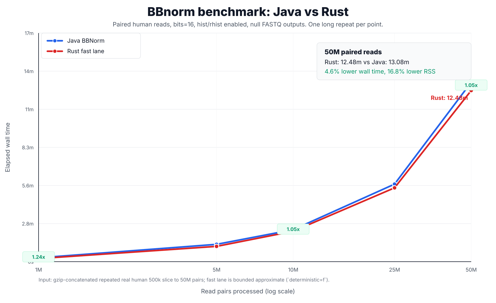

# bbnorm-rs

`bbnorm-rs` is a Rust implementation of the practical BBTools BBNorm read-depth
normalization workflow. It is built for local FASTA/FASTQ normalization,
histogram generation, paired/interleaved routing, bounded-memory k-mer counting,
and Java-parity testing against the vendored BBTools reference.

This is an early working release. It is not a complete drop-in replacement for
all BBTools commands or every BBNorm edge case.

## Install

Install from a checkout:

```bash
cargo install --path .
```

Use it as a Rust crate from a checkout:

```toml
bbnorm-rs = { path = "../bbnorm-rs" }
anyhow = "1"
```

```rust
use std::ffi::OsString;

use bbnorm_rs::{parse_args, run};

fn main() -> anyhow::Result<()> {
    let args = [
        "bbnorm-rs",
        "in=reads_R1.fq.gz",
        "in2=reads_R2.fq.gz",
        "out=normalized_R1.fq.gz",
        "out2=normalized_R2.fq.gz",
        "target=40",
        "max=80",
        "min=5",
        "k=31",
    ]
    .map(OsString::from);
    let config = parse_args(args)?;
    let summary = run(&config)?;
    println!("kept {} reads", summary.reads_kept);
    Ok(())
}
```

The library API is still young; the command-line interface is the most stable
surface.

## Quick Start

Normalize paired FASTQ:

```bash
bbnorm-rs in=reads_R1.fq.gz in2=reads_R2.fq.gz \
  out=normalized_R1.fq.gz out2=normalized_R2.fq.gz \
  target=40 max=80 min=5 k=31 threads=8
```

Write keep/toss streams plus depth outputs:

```bash
bbnorm-rs in=reads.fq.gz \
  out=keep.fq.gz outt=toss.fq.gz \
  hist=depth.tsv rhist=read_depth.tsv peaksout=peaks.tsv
```

Run the high-throughput bounded approximate lane:

```bash
bbnorm-rs in=reads_R1.fq.gz in2=reads_R2.fq.gz \
  out=null out2=null outt=null outt2=null \
  hist=depth.tsv rhist=read_depth.tsv \
  target=40 max=80 min=5 k=31 bits=16 \
  autocountmin=t autocountminreads=1 deterministic=f threads=8
```

`deterministic=f` allows nondeterministic atomic packed sketch updates. It is
fast and memory efficient, but bounded-sketch histogram output is not expected
to be byte-identical to Java.

## What Works

- Plain and gzip FASTA/FASTQ input and output.
- Single-end, paired two-file, explicit interleaved, and auto-interleaved input.
- BBTools-style `key=value` options and common aliases.
- `null` output sinks for safe benchmark and filtering runs.
- Exact and bounded count-min k-mer counting.
- Short canonical k-mers and BBTools-shaped long-kmer hashes.
- Depth histograms, read-depth histograms, peak output, and common side outputs.
- Multipass, count-up, ECC, qtrim, minlen, and routing behavior for tested modes.
- Repository-only Java parity tests against the vendored BBTools snapshot.

Known limits:

- Full BBTools sketch, prefilter, and cardinality/loglog collision parity is not
  complete.
- ECC and overlap behavior are covered by focused tests, but not every
  BBMerge/BBNorm edge case.
- High-throughput bounded approximate mode trades byte-stable collision order
  for speed.

See [docs/parity.md](docs/parity.md), [docs/parity_matrix.md](docs/parity_matrix.md),
and [docs/component_buildout.md](docs/component_buildout.md) for the detailed
compatibility ledger.

## Benchmarks

Use [`scripts/benchmark_trustworthy_baseline.py`](scripts/benchmark_trustworthy_baseline.py)
for repeatable Java/Rust comparisons. It records git state, tool versions,
input metadata, command lines, raw run data, stage timings, RSS, and histogram
drift.



### Local 500k Paired-Human Lane

Three-repeat median, paired human slice, `bits=16`, `threads=8`, null read
outputs, `hist` and `rhist` enabled:

| Tool | Wall time | Peak RSS |
| --- | ---: | ---: |
| Java BBNorm | 7.814 s | 3.39 GiB |
| bbnorm-rs fast lane | 6.769 s | 2.79 GiB |

Result: Rust was 13.4% faster and used 17.8% less peak RSS on this lane.

Artifact:
`tmp/fastlane_atomic_packed_fusedhist_500k_compare_20260515_115057`

### Large Local Stress Sweep

One long repeat per point, using a gzip-concatenated repeated real human 500k
slice to scale up to 50M paired reads:

| Read pairs | Java time | Rust time | Speedup | Rust RSS |
| ---: | ---: | ---: | ---: | ---: |
| 1M | 16.9 s | 13.6 s | 1.24x | 2.79 GiB |
| 5M | 1.27 m | 1.12 m | 1.13x | 2.79 GiB |
| 10M | 2.33 m | 2.22 m | 1.05x | 2.79 GiB |
| 25M | 5.65 m | 5.38 m | 1.05x | 2.79 GiB |
| 50M | 13.08 m | 12.48 m | 1.05x | 2.79 GiB |

At 50M paired reads, Rust completed in 12.48 minutes versus Java at 13.08
minutes, with 16.8% lower peak RSS. This is a performance stress benchmark, not
a unique 50M-read biological dataset.

Artifact:
`tmp/scaling_fastlane_large_20260515_121613`

## Correctness Claims

The repository test suite includes Java-parity integration tests for covered
modes. Exact covered fixture modes are expected to match the vendored Java
oracle byte-for-byte.

The high-throughput `deterministic=f` bounded approximate lane is different:
it is designed for speed and bounded memory, not byte-identical collision order.
Report histogram drift for that lane instead of claiming identical k-mer output.

## GPU Status

Experimental CUDA helpers live under `scripts/` and are documented in
[docs/gpu_counting_integration.md](docs/gpu_counting_integration.md).

Build the helpers with:

```bash
scripts/build_cuda_kmer_reduce_runs.sh
```

The current GPU integration is useful as a research lane, but it should not be
the headline performance path yet. The parity-safe persistent helper preserves
chunk replay semantics, but previous measurements were slower than the CPU path
because of host/device copies, pipe serialization, and replay overhead.

It is worth benchmarking the GPU hybrid path again only if the experiment is
kept separate from the published CPU fast-lane claim, ideally with:

- a small smoke run to prove the helper still works,
- a 500k comparison against the current `deterministic=f bits=16` CPU fast lane,
- and a larger 5M or 10M run only if the 500k result is promising.

## Development Checks

Before making performance claims:

```bash
cargo fmt --all -- --check
cargo clippy --all-targets --all-features -- -D warnings
cargo test --all
```

This repository keeps the vendored BBTools snapshot and Java parity tests local
to the GitHub source tree.

## Repository Layout

- `src/`: Rust library and CLI implementation.
- `tests/basic.rs`: package-friendly integration tests.
- `tests/java_parity.rs`: repository-only Java parity tests requiring
  `vendor/BBTools-master`.
- `docs/`: parity, benchmark, performance, and GPU notes.
- `scripts/`: benchmark, parity, stress, and CUDA helper scripts.
- `vendor/`: BBTools reference snapshot for repository testing only.

## License

`bbnorm-rs` is licensed under the BSD 3-Clause License. The vendored BBTools
reference snapshot in the source repository is distributed under its own
license at `vendor/BBTools-master/license.txt`.
